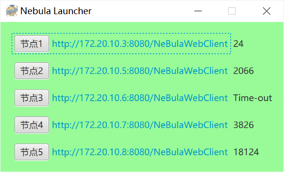

# NeBula Starter

NeBula is a distributed online shopping system, which is a coursework of the course *Distributed Systems*, developed by a group of students of LUC@BJTU.

The name is given due to the name of the IDE designated by the professor, NetBeans, which could be simply noted as NB. We wanted to achieve a similar effect, and NeBula seems to be a good name.

This repository contains the starter for NeBula. The interface is shown as follows.



There are also a [backend server](https://github.com/V1ctorL/NeBula) and [web client](https://github.com/V1ctorL/NeBulaWebClient).

## Install

You can get each part of the code via the related commends.

**The Backend Services**

```shell
git clone git@github.com:V1ctorL/NeBula.git
```

**The Web Client**

```shell
git clone git@github.com:V1ctorL/NeBulaWebClient.git
```

**The Starter**

```shell
git clone git@github.com:V1ctorL/NeBulaStarter.git
```

## Usage

You can run the projects which your preferred IDE. Since they are developed with NetBeans, it is a recommended one.

This project takes advantages of SOAP services provided by the [web client](https://github.com/V1ctorL/NeBulaWebClient) to test the network latency. When you are deploying the [web client](https://github.com/V1ctorL/NeBulaWebClient) on multiple machines, you can add more `Web Service Client` or remove the redundant ones in this starter. Remember to implement the related codes in `Ping.java`, and change the IP addresses in `Main.java` to be the addresses of your web client servers.

## Dependencies

None

